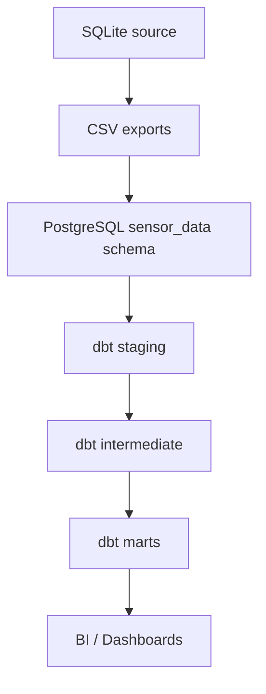

# Architecture

## Layers
- **Raw**: CSV-loaded tables in PostgreSQL (`sensor_data.raw_sensor_readings`, `sensor_data.raw_sensor_locations`).
- **Staging**: Type casting, renaming, and basic validation.
- **Intermediate**: Enrichment and quality flag logic.
- **Marts**: Dimensional model and daily summaries.
